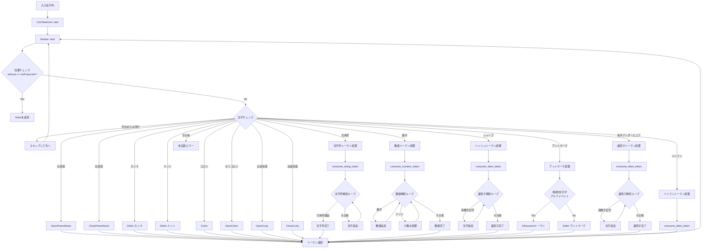

## CSSの字句解析

```mermaid
flowchart TD
    Start[入力文字列] --> Init[CssTokenizer::new]
    Init --> Iterator[Iterator::next]
    Iterator --> PosCheck{"位置チェック<br/>self.pos >= self.input.len?"}
    PosCheck -->|Yes| EndNone[Noneを返却]
    PosCheck -->|No| Check{文字チェック}

    Check -->|左括弧| OpenParen[OpenParenthesis]
    Check -->|右括弧| CloseParen[CloseParenthesis]
    Check -->|カンマ| CommaDelim[Delim カンマ]
    Check -->|ドット| DotDelim[Delim ドット]
    Check -->|コロン| Colon[Colon]
    Check -->|セミコロン| SemiColon[SemiColon]
    Check -->|左波括弧| OpenCurly[OpenCurly]
    Check -->|右波括弧| CloseCurly[CloseCurly]
    Check -->|空白または改行| Skip[スキップして次へ]
    
    Check -->|引用符| String[文字列トークン処理]
    String --> ConsStr[consume_string_token]
    ConsStr --> StrLoop{文字列解析ループ}
    StrLoop -->|引用符検出| StrEnd[文字列完了]
    StrLoop -->|その他| StrCont[文字追加]
    StrCont --> StrLoop
    
    Check -->|数字| Number[数値トークン処理]
    Number --> ConsNum[consume_numeric_token]
    ConsNum --> NumLoop{数値解析ループ}
    NumLoop -->|数字| NumAdd[数値追加]
    NumLoop -->|ドット| Float[小数点処理]
    NumLoop -->|その他| NumEnd[数値完了]
    NumAdd --> NumLoop
    Float --> NumLoop
    
    Check -->|シャープ| Hash[ハッシュトークン処理]
    Hash --> ConsHash[consume_ident_token]
    ConsHash --> HashLoop{識別子解析ループ}
    HashLoop -->|英数字記号| HashAdd[文字追加]
    HashLoop -->|その他| HashEnd[識別子完了]
    HashAdd --> HashLoop
    
    Check -->|アットマーク| At[アットマーク処理]
    At --> AtCheck{後続3文字が<br>アルファベット}
    AtCheck -->|Yes| AtKeyword[AtKeywordトークン]
    AtCheck -->|No| AtDelim[Delim アットマーク]
    
    Check -->|英字アンダースコア| Ident[識別子トークン処理]
    Ident --> ConsIdent[consume_ident_token]
    ConsIdent --> IdentLoop{識別子解析ループ}
    IdentLoop -->|英数字記号| IdentAdd[文字追加]
    IdentLoop -->|その他| IdentEnd[識別子完了]
    IdentAdd --> IdentLoop
    
    Check -->|ハイフン| Hyphen[ハイフントークン処理]
    Hyphen --> ConsHyphen[consume_ident_token]
    
    Check -->|その他| Unimpl[未実装エラー]
    
    Skip --> Iterator
    OpenParen --> RetToken[トークン返却]
    CloseParen --> RetToken
    CommaDelim --> RetToken
    DotDelim --> RetToken
    Colon --> RetToken
    SemiColon --> RetToken
    OpenCurly --> RetToken
    CloseCurly --> RetToken
    StrEnd --> RetToken
    NumEnd --> RetToken
    HashEnd --> RetToken
    AtKeyword --> RetToken
    AtDelim --> RetToken
    IdentEnd --> RetToken
    ConsHyphen --> RetToken
    
    RetToken --> Iterator
```
