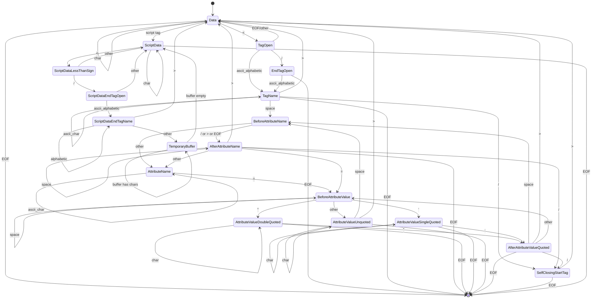

# HTMLトークナイザー

ステートマシン図は以下。

```mermaid
stateDiagram-v2
    [*] --> Data

    Data --> TagOpen: <
    Data --> [*]: EOF
    Data --> Data: char

    TagOpen --> EndTagOpen: /
    TagOpen --> TagName: ascii_alphabetic
    TagOpen --> Data: EOF/other

    EndTagOpen --> TagName: ascii_alphabetic
    EndTagOpen --> [*]: EOF

    TagName --> BeforeAttributeName: space
    TagName --> SelfClosingStartTag: /
    TagName --> Data: >
    TagName --> TagName: ascii_char
    TagName --> [*]: EOF

    BeforeAttributeName --> AfterAttributeName: / or > or EOF
    BeforeAttributeName --> AttributeName: other

    AttributeName --> AttributeName: / or > or EOF
    AttributeName --> BeforeAttributeValue: =
    AttributeName --> AttributeName: ascii_char

    AfterAttributeName --> AfterAttributeName: space
    AfterAttributeName --> SelfClosingStartTag: /
    AfterAttributeName --> BeforeAttributeValue: =
    AfterAttributeName --> Data: >
    AfterAttributeName --> AttributeName: other
    AfterAttributeName --> [*]: EOF

    BeforeAttributeValue --> BeforeAttributeValue: space
    BeforeAttributeValue --> AttributeValueDoubleQuoted: "
    BeforeAttributeValue --> AttributeValueSingleQuoted: '
    BeforeAttributeValue --> AttributeValueUnquoted: other

    AttributeValueDoubleQuoted --> AfterAttributeValueQuoted: "
    AttributeValueDoubleQuoted --> AttributeValueDoubleQuoted: char
    AttributeValueDoubleQuoted --> [*]: EOF

    AttributeValueSingleQuoted --> AfterAttributeValueQuoted: '
    AttributeValueSingleQuoted --> AttributeValueSingleQuoted: char
    AttributeValueSingleQuoted --> [*]: EOF

    AttributeValueUnquoted --> BeforeAttributeName: space
    AttributeValueUnquoted --> Data: >
    AttributeValueUnquoted --> AttributeValueUnquoted: char
    AttributeValueUnquoted --> [*]: EOF

    AfterAttributeValueQuoted --> BeforeAttributeName: space
    AfterAttributeValueQuoted --> SelfClosingStartTag: /
    AfterAttributeValueQuoted --> Data: >
    AfterAttributeValueQuoted --> BeforeAttributeValue: other
    AfterAttributeValueQuoted --> [*]: EOF

    SelfClosingStartTag --> Data: >
    SelfClosingStartTag --> [*]: EOF

    Data --> ScriptData: script tag

    ScriptData --> ScriptDataLessThanSign: <
    ScriptData --> ScriptData: char
    ScriptData --> [*]: EOF

    ScriptDataLessThanSign --> ScriptDataEndTagOpen: /
    ScriptDataLessThanSign --> ScriptData: other

    ScriptDataEndTagOpen --> ScriptDataEndTagName: ascii_alphabetic
    ScriptDataEndTagOpen --> ScriptData: other

    ScriptDataEndTagName --> Data: >
    ScriptDataEndTagName --> TemporaryBuffer: other
    ScriptDataEndTagName --> ScriptDataEndTagName: alphabetic

    TemporaryBuffer --> ScriptData: buffer empty
    TemporaryBuffer --> TemporaryBuffer: buffer has chars
```
