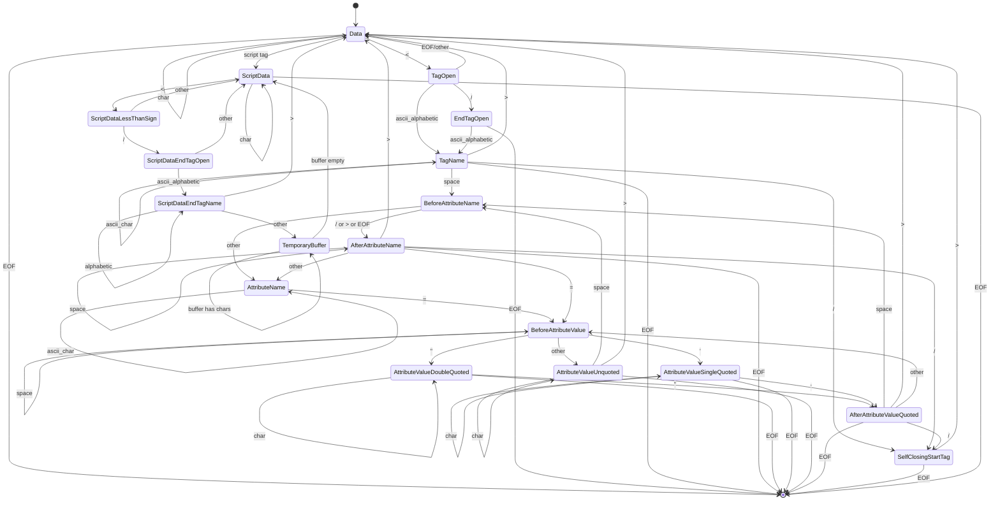
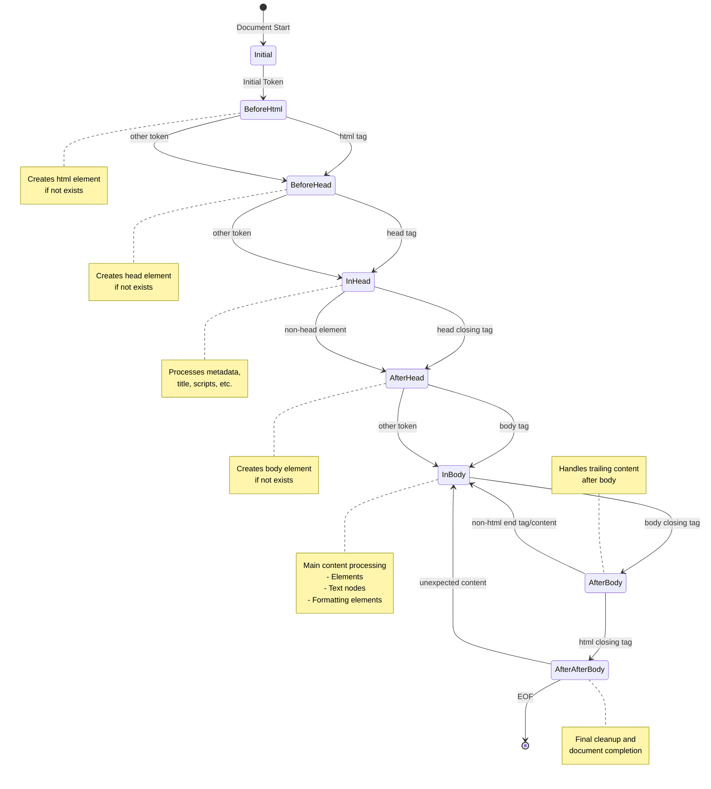

# HTMLトークナイザー

ステートマシン図は以下。

## HTMLパーサーの流れ

<https://html.spec.whatwg.org/multipage/parsing.html#tree-construction>

### Insertion Mode

一部のみ。

- Initial → BeforeHTML: 文書の開始処理
- BeforeHead → InHead: head要素の処理開始
- InHead → AfterHead: メタデータ処理の完了
- AfterHead → InBody: メインコンテンツの処理開始
- InBody → AfterBody: 本文処理の完了
- AfterAfterBody → [*]: 文書処理の完了

### エッジケース

- 予期しないコンテンツによる状態の巻き戻し（例：AfterAfterBody → InBody）
- 必須要素の自動生成
- クリーンアップ処理

## ステートマシン図

