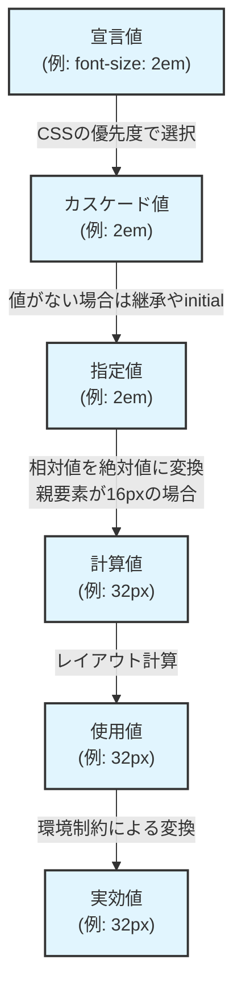

ComputedStyle構造体の実装について。

## CSSの値の変化

### 1. 宣言値

ユーザが直接指定した値そのもの
例）

```css
font-size: 2em
margin: 10%
color: blue
```

### 2. カスケード値

複数のスタイルが競合した場合の優先順位で決まる値
優先順位の例）

- !important付きのスタイル
- インラインスタイル
- IDセレクタ
- クラスセレクタ
- 要素セレクタ

### 3. 指定値

カスケード値がない場合に決定される値
値の決定方法：

- 継承（親要素から値を受け継ぐ）
- 初期値（ブラウザのデフォルト値）

### 4. 計算値

相対値を絶対値に変換
例）

- 2em → 32px（親要素の16pxの2倍）
- margin: 10% → まだ相対値のまま（レイアウト計算が必要なため）

### 5. 使用値

レイアウト計算後の最終的な値
例）

- margin: 10% → 50px（親要素の幅が500pxの場合）

### 6. 実効値

デバイスやブラウザの制約を反映した値
例）

- フォントが存在しない場合のフォールバック
- ディスプレイの解像度による調整

## 流れ


